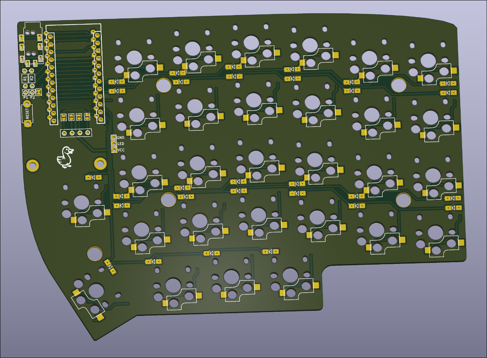

# SillyWilly58

SillyWilly58 is a modified Lily58 split keyboard PCB designed to support **Kailh Choc v2 low-profile switches**. It maintains the familiar Lily58 layout while adapting the footprint and routing for improved compatibility with modern low-profile builds.

## Features

* Split ergonomic layout (Lily58-based)
* Support for **Kailh Choc v1 and v2 switches**
* Per-key diode footprint
* Pro Micro / Elite-C compatible
* TRRS connectivity between halves
* Compact, low-profile-friendly design

## Changes from Lily58

* Updated switch footprints for **Choc v2**
* Minor layout and PCB optimizations
* Cleaned up silkscreen and labeling

## Hardware Requirements

* 2× Pro Micro / Elite-C (or compatible controllers)
* 2× TRRS jacks
* 1× TRRS cable
* ~58× Kailh Choc v2 switches
* 58× diodes (SMD or through-hole depending on build)
* Keycaps compatible with Choc v2 stems
* Optional: OLED displays

## Firmware

SillyWilly58 is compatible with:

* [QMK Firmware](https://qmk.fm/)
* [ZMK](https://zmk.dev/) (with appropriate configuration)

You can start from Lily58 configs and adjust the matrix if needed.

## Build Notes

* Haven't ordered one yet so I cannot verify that it works
* Ensure correct orientation of diodes
* Verify controller pinout before soldering

